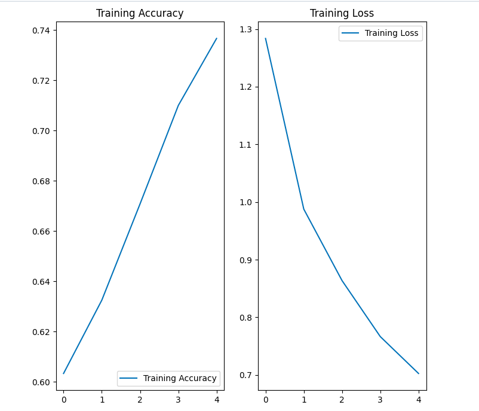

# Building-a-model-pipeline-for-Review-Classification-using-a-GRU-model

## Project Description
The purpose of this project is to build a review classification model, that does sentiment analysis of the review text data from an application which is scaled in the rage of 1 to 5, to identify 5 as a positive sentiment and 1 as a negative sentiment. The deep learning model was built using GRU (Gated Recurrent Unit) which is a variant of RNN ( Recurrent Neural Network). The model is trained on the training review data and their properties to predict the sentiment. This project outlines an automated model pipeline from building model to its deployment enabling the use of deployed model in a scalable way to make real-time decisions based on the sentiment predictions of the app reviews.

## GRU ---importance of GRU as a RNN 
## Objective 
## Modular code overview 
## Data 
The dataset contains `content` and `score` columns that respectively represent the review text and the rating given by the user based on their review. The score contains values between 0-5, reflecting the sentiment expressed in the review.

## Model Buiding Pipeline 
The model building pipeline contains several steps
1. Preprocessing the dataset:
 - Clean the dataset by removing stopwords and lemmatizing text to ensure an appropriate format.
 - Tokenize the cleaned data for further processing.

2. Model training
 - Split the preprocessed dataset to training and testing sets.
 - Build a GRU (Gated Recurrent Unit) model and train it using the training dataset.

3. Model deployment
- Develop a REST API using the Flask web framework to deploy the trained model.
- Implement a model engine script using subprocesses to automate the execution of multiple processes.
    

### Preprocessing the dataset 
#### 1. Cleaning the dataset 

The text data is often in incosistent formats which must be structured and standerdized to an appropriate format for the machine learning model, enabling machine learning models to deliver more accurate predictions and reliable insights.

Stopwords are common words that are found in the text data which don't add a significant meaning to text analysis. Removing stopwords helps improve model efficiency and reduces noise in the dataset. These words vary by language, and predefined lists exist for different NLP applications. Stop words ca be accessed using the text corpus of the **NLTK** library which is a common python library used in NLP ( Natural Language  Processing)tasks.

Text data often contains different variations of the same words, introducing variability that needs to be standardized during preprocessing.Lemmatization is a data preprocessing technniqe that transforms words into their dictionary form (lemma), based on the context of the words while preserving their contextual meaning and linguistic integrity.

The **cleaning(df,stopwords)** function within [preprocessing script](SRC/ML_pipeline_vidisha/preprocess_vidisha.py) demonstrates a sequence of steps used in data cleaning process. 
```python

import nltk
import textblob
from textblob import Word # use for lemmatization 
from nltk.corpus import stopwords
stop_words=stopwords.word('english') # should remove these words

def cleaning(df,stop_words):
    df['content'] = df['content'].apply(lambda x: ' '.join(x.lower() for x in x.split())) # convert words in the review text to lowercase 
    df['content'] = df['content'].str.replace("[^0-9a-zA-Z\s]+", '') # Use a regex to replace special characters with spaces
    df['content'] = df['content'].apply(lambda x: ' ' .join ( x for x in x.split() if x not in stop_words)) # remove stopwords 
    df['content'] = df['content'].apply(lambda x: ' '.join([Word(x).lemmatize() for x in x.split()])) # lemmatize each word in review text
    return df
```

- The **wordcloud** library is used to  generate a word cloud that visually represents the most frequently occuring words in the prepocessed text data. The below image gives a quick insight about the dominant trends or themes in the app review text data, which are `app`, `design`,`good` and `easy`.

  

#### 2. Tokenizing the data
Cleaned text data must be transformed into a structured format that machine learning algorithms can process and learn from the data for text analysis.Tokenization is the process of breaking down text into smaller units, known as tokens, which can be words, phrases, sentence or subwords.By enabling ML models to understand individual words and their contextual relationships in the text data it enable the model to effective analyze the text setiments and enhance the model performance by improving the accuracy and relevance of text-based predictions.

In the model API, users can choose whether to train a new dataset, make real-time predictions on review data, or deploy the model. To automate the tokenization process based on the user's selection, the **tokenize(df,df_new,is_train)** function is defined in the [preprocessing script](SRC/ML_pipeline_vidisha/preprocess_vidisha.py). If user selects training option, the function builds a tokenizer using the training data and save the [trained tokenizer](Output/tokenizer.pkl) as a pickle file for future use.

The [utility module](SRC/ML_pipeline_vidisha/utils_vidisha.py) defines the the maximum numeber of unique words selected from the vocabulary for tokenization (top_words= 5000) and input length of word sequence (input_length=500) reffers to the standardized number of tokens from the text sequence passed for tokenization.It maintains the consistency in the input sequence by truncating longer sequence or padding shorter sequence.

```python
  import tensorflow
  from tensorflow.keras.preprocessing.text import Tokenizer
  from tensorflow.keras.preprocessing.sequence import pad_sequence
  def tokenize(df,df_new,is_train):
     if is_train==1:
        tokenizer=Tokenizer(num_words=input_length,split=' ') # build a tokenizer 
        tokenizer.fit_on_texts(df_new['content'].values) # train the tokenizer on preprocessed training dataset
        with open('Output/tokenizer.pkl','wb') as handle:  # Save the tarined tokenizer
            pickle.dump(tokenizer, handle)
        x=tokenizer.texts_to_sequences(df['content'].values) # tokenize the text in new data using the trained tokenizer
        x=pad_sequences(x,input_length) # Convert tokenized sequences to a uniform length for ML model
        return x

    else:
        with open('output/tokenizer.pkl','rb') as handle: # if not training load the already trained and saved tokenizer
            tokenizer=pickle.load(handle)
        x=tokenizer.texts_to_sequences(df['content'].values)
        x=pad_sequences(x,utils_vidisha.input_length)
        return x
```
### Model Training
#### 1. Split the dataset for training and testing splits

The target variable `score` contains numerical values ranging from 0 to 5. However, for sentiment analysis, it should be one-hot encoded to represent discrete sentiment categories—where 0 corresponds to "Very Negative" and 5 to "Very Positive." This encoding prevents the model from making incorrect ordinal assumptions, ensuring it treats sentiment scores as distinct classes rather than continuous values. 
```python
from sklearn.model_selection import train_test_split
y = pd.get_dummies(df['score'])
X_train, X_test, y_train, y_test = train_test_split(X, y, test_size = 0.2, random_state = 42)
```
 #### 2. Build and train the GRU model 

The **fit(x_train,y_train)** function in [train model](SRC/ML_pipeline_vidisha/train_model_vidisha.py) is  defined to iniitiate and train the model , when x and y sets of the training data are given. The **train(model, x_train, y_train)** function shows that training data is split into 32 batches, to make training more manageable and computationally efficient. The model computes gradients and updates weights after processing each batch, continuing until all batches in the dataset have been processed, completing one epoch. During training, the model iterates through the entire dataset 50 times (epochs=50), allowing it to learn deeper patterns and improve its performance. To prevent overfitting, the number of epochs is capped at 50, ensuring the model generalizes well to new data.The **train()** function returns the trained model and it saves the accuracy and  training loss of the model during each epoch in a history object.The [trained model](Output/gru_model_vidisha.h5) is saved in the output folder for future use. 

To ensure model works with the structured input, ***Embedding()*** layer  is placed at the start of the model layers to  transform the raw text tokens which are in numerical values to a dense vector representation that capture semantic meanings of the words. ***SpatialDropout()*** layer drops entire feature maps instead of randomly dropping neurons, ensuring the model doesn't become overly dependent on specific word patterns. This regularization technique prevents overfitting of the sequence-based text data and improve generalization making the model more robust for unseen data. The output, ***Dense()*** layer contains 5 neurons corresponding to 5 sentiment categories and uses softmax activation enabling model to assign confidence score to each sentiment category.

The following image shows the change of the  model's training accuracy and training loss during 8 epochs, deomstrating a great performance.



### Model Deployment
#### 1.Develop a REST API using the Flask web framework to deploy the trained model.


- Implement a model engine script using subprocesses to automate the execution of multiple processes.


## The model engine 
In order to build a robust and streamlined model pipeline, the python submodule **subprocess** was used to ochestrate multiple tasks in parallel using pre-defined functions. It leverages the subprocess module to trigger and run external scripts in seperate processes enabling modular execution of training, prediction or depoyment of the model in both development or production environment. The [model engine](SRC/engine_vidisha.py) demonstrates the ochestration of seperate scripts for data preprocessing, model training and deployment.
